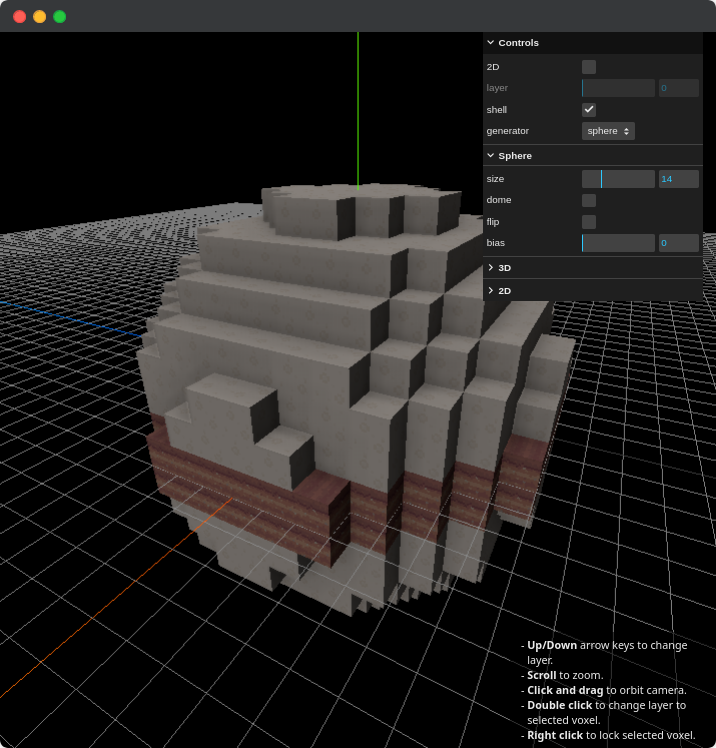

# voxel-plot
3D Voxel shape generator + viewer. Currently supports:
- Layer slicing / onion skinning
- 2D/3D views
- Sphere, Hemisphere, Cube



## Developing

Once you've installed dependencies with `pnpm install`, start a development server with:

```bash
pnpm run dev

# or start the server and open the app in a new browser tab
pnpm run dev -- --open
```

## Building

To create a production version of the app:

```bash
pnpm run build
```

You can preview the production build with `pnpm run preview`.